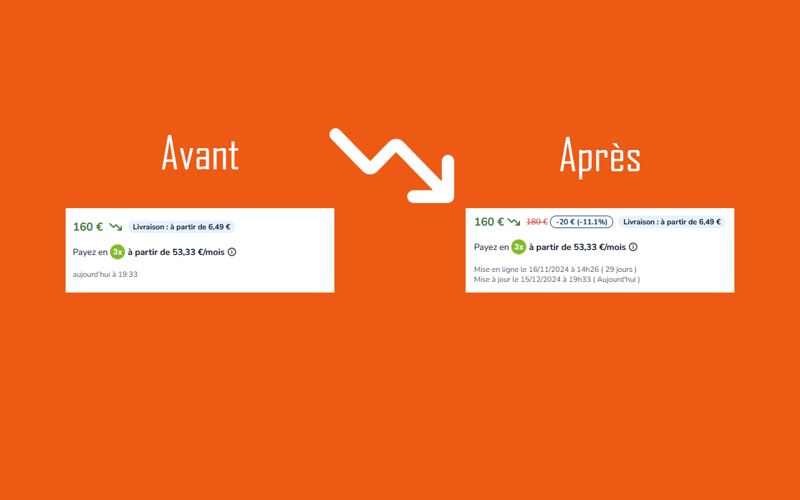

# lbc_old_price

## Description

🇫🇷 Ce code vous permet de voir le prix de vente de n'importe quel objet avant son changement (↘) ainsi que la date de mise en ligne de l'annonce

----

🇺🇸 This code allows you to see the selling price of any item before its change (↘), as well as the date the advertisement was posted.

## Addon Page

[](https://addons.mozilla.org/fr/firefox/addon/price-history-4-lbc/) 
[](https://chrome.google.com/webstore/detail/item-price-history-lebonc/fcidkhdnnclgekjnmgpohmejgpfanpdj)

## Screenshots





## Release PY

```
python -m pip install pyinstaller
./startRelease.bat
```